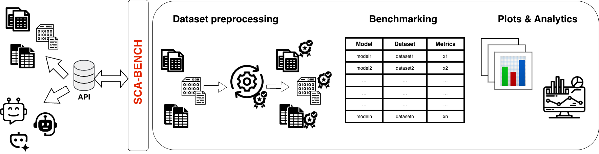

# MLSCA-Bench

*A unified benchmarking framework for Machine Learning-based Side-Channel Analysis.*

MLSCA-Bench aims to standardize datasets, evaluation protocols, and reporting practices for machine learning-based side-channel analysis. It provides a common framework for developing, evaluating, and comparing ML-SCA methods under reproducible and consistent conditions.

---

## Why MLSCA-Bench?

Deep learning has become a dominant approach for profiling side-channel attacks, yet the ML-SCA ecosystem remains fragmented.

Current research often suffers from:

- Different dataset formats and preprocessing pipelines.
- Inconsistent evaluation protocols.
- Difficult-to-reproduce experimental settings.
- Incomparable performance metrics across papers.

These inconsistencies make it difficult to fairly compare methods or reproduce published results.

MLSCA-Bench addresses these issues by providing a unified benchmarking framework that enables consistent evaluation across datasets, devices, countermeasures, and machine learning models. By establishing standardized benchmarks and a common foundation, we hope to accelerate progress in machine learning-based side-channel analysis while improving the reproducibility and transparency of published research.

---

## Roadmap

The project is being developed incrementally.

Planned components include:

- [ ] Unified dataset loaders
- [ ] Common preprocessing pipeline
- [ ] Reference implementations of ML-SCA models
- [ ] Standard evaluation metrics
- [ ] Benchmark configuration system
- [ ] Experiment tracking and reporting
- [ ] Leaderboard and reproducibility guidelines

---

---

## Contributing

MLSCA-Bench is an open research initiative developed by the [ESSEC group](https://www.unibw.de/essec) at the [University of the Bundeswehr Munich](https://www.unibw.de/home-en). We welcome feedback, collaborations, and contributions from the side-channel analysis and machine learning communities.

If you would like to contribute, please open an issue, submit a pull request or contact us at `iris.jimenez@unibw.de`. 

---

## License

See the LICENSE file for details.

---

## Citation 

if you use MLSCA-Bench, please cite us: 

```
@unpublished{MLASCA_Bench_2026,
  author       = {Iris Dania Jimenez and Michael Hutter},
  title        = {MLSCA-Bench: A Unified Benchmarking Framework for Machine Learning-based Side-Channel Analysis},
  year         = {2026},
  note         = {Manuscript submitted for publication},
}
```